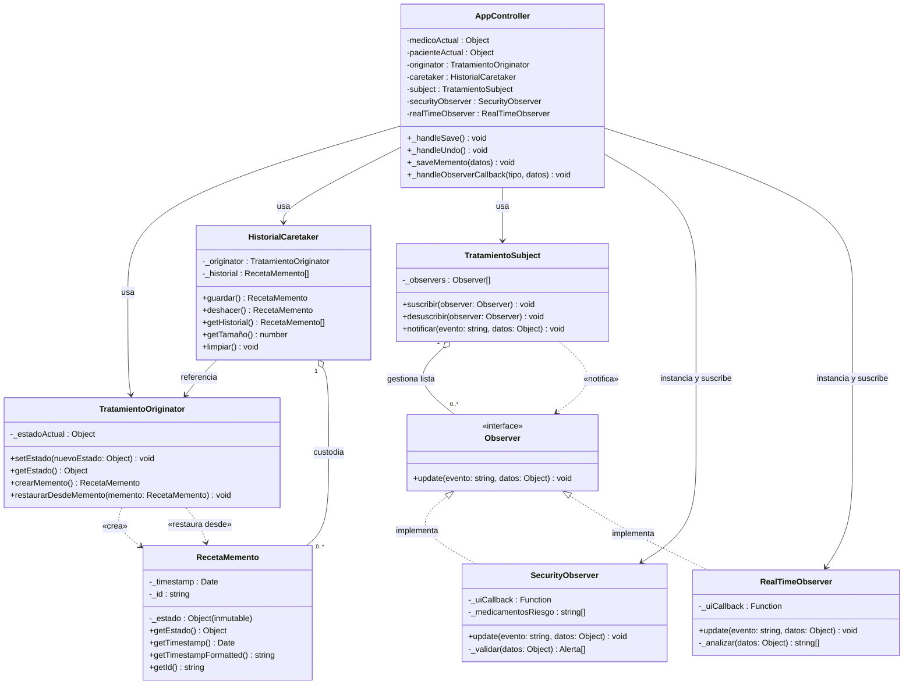

# Memento
Memento Hospital
# MediTrack Pro — Documentación Técnica de Patrones de Diseño

---

## 1. Diagrama de Clases UML 



---

## 2. Documentación de Interacción de Patrones

### Flujo Completo al Presionar **"Guardar Receta"**

```
[UI: Médico llena formulario y hace clic en "Guardar"]
        │
        ▼
AppController._handleSave()
        │
        ├─── 1. Lee datos del formulario (_readForm)
        │
        ├─── 2. 📣 OBSERVER — subject.notificar("ANTES_DE_GUARDAR", datos)
        │           │
        │           ├──► SecurityObserver.update("ANTES_DE_GUARDAR", datos)
        │           │         │
        │           │         └─ _validar(datos):
        │           │               • ¿Dosis > 1000mg?  → alerta CRÍTICO
        │           │               • ¿Fármaco riesgo + cada 6h? → alerta ADVERTENCIA
        │           │               • ¿Dosis alta + freq. alta?  → alerta ADVERTENCIA
        │           │             Resultado → _uiCallback("seguridad", [alertas])
        │           │
        │           └──► RealTimeObserver.update() — ignorado (evento incorrecto)
        │
        ├─── 3a. ¿Hay alertas? → SÍ
        │           └─ Abrir Modal de Seguridad (UI bloqueante)
        │               ├── [Cancelar]  → No se guarda. Log de seguridad.
        │               └── [Continuar] → pendingProceed() → ir a paso 4
        │
        ├─── 3b. ¿Hay alertas? → NO
        │           └─ Ir directamente al paso 4
        │
        └─── 4. 💾 MEMENTO — _saveMemento(datos)
                    │
                    ├─ originator.setEstado(datos)
                    │     └─ Actualiza _estadoActual
                    │
                    ├─ caretaker.guardar()
                    │     ├─ originator.crearMemento()
                    │     │     └─ new RecetaMemento(estadoActual) ← snapshot inmutable
                    │     └─ _historial.push(memento)
                    │
                    └─ UI: renderHistory() + Toast "Receta guardada"
```

---

### Flujo al Presionar **"Deshacer"**

```
[UI: Médico hace clic en "↩ Deshacer"]
        │
        ▼
AppController._handleUndo()
        │
        ├─── Verificar: caretaker.getTamaño() >= 2 ?
        │         └── NO → Toast "Sin historial previo". FIN.
        │
        └─── SÍ → caretaker.deshacer()
                    │
                    ├─ _historial.pop()  ← Elimina el Memento más reciente
                    │
                    ├─ anterior = _historial[_historial.length - 1]
                    │
                    ├─ originator.restaurarDesdeMemento(anterior)
                    │     └─ _estadoActual = anterior.getEstado() ← copia del snapshot
                    │
                    └─ Retorna `anterior` al AppController
                              │
                              ├─ _writeForm(mementoRestaurado.getEstado())
                              │     └─ Popula inputs del formulario con estado previo
                              │
                              ├─ _renderHistory() ← Actualiza sidebar visual
                              └─ Toast "Estado restaurado" + Log Observer
```

---

### Flujo del **Observer en Tiempo Real** (RealTimeObserver)

```
[UI: Médico escribe/cambia cualquier input]
        │
        ▼
EventListener "input" → subject.notificar("CAMPO_MODIFICADO", datos)
        │
        └──► RealTimeObserver.update("CAMPO_MODIFICADO", datos)
                    │
                    └─ _analizar(datos):
                          • Dosis > 1000mg → hint visual crítico
                          • Dosis > 500mg  → hint visual de precaución
                          • Alta dosis + cada 6h → cálculo de dosis/día
                       Resultado → _uiCallback("realtime", [hints])
                          │
                          └─ Muestra/oculta banner de alerta en tiempo real
                             (sin modal, sin bloquear — solo orientación visual)
```

---

## 3. Tabla de Responsabilidades

| Clase | Patrón | Responsabilidad única |
|-------|--------|----------------------|
| `RecetaMemento` | Memento | Almacenar un snapshot **inmutable** del estado de la receta con timestamp |
| `TratamientoOriginator` | Memento | Propietario del estado actual; **único** capaz de crear/restaurar Mementos |
| `HistorialCaretaker` | Memento | Custodiar la lista de Mementos; implementar lógica de **undo** |
| `Observer` | Observer | Contrato/interfaz: cualquier observer debe implementar `update()` |
| `TratamientoSubject` | Observer | Mantener la lista de observers y **notificarlos** ante eventos |
| `SecurityObserver` | Observer | Validar parámetros de seguridad **antes** de persistir la receta |
| `RealTimeObserver` | Observer | Retroalimentación inmediata **mientras** el médico escribe |
| `AppController` | Orquestador | Coordinar ambos patrones; gestionar el flujo de la aplicación |

---

## 4. Principios de Diseño Aplicados

- **Encapsulación (Memento):** El estado de `RecetaMemento` es `Object.freeze()` — garantía de inmutabilidad en runtime.
- **Inversión de dependencias (Observer):** `TratamientoSubject` depende de la abstracción `Observer`, no de las implementaciones concretas.
- **Principio Abierto/Cerrado:** Se pueden agregar nuevos Observers (ej. `AuditObserver`, `EmailAlertObserver`) sin modificar `TratamientoSubject`.
- **Separación de concerns:** La lógica de validación vive en `SecurityObserver`, la UI vive en `AppController`, y la gestión de estado en `Originator`/`Caretaker`.
